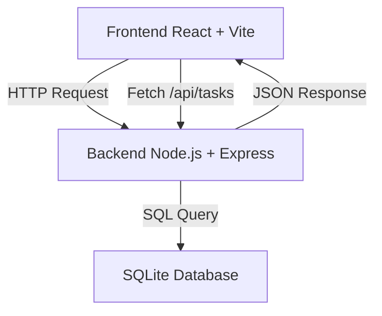

# ats-lti-project

Proyecto base para el ejercicio ATS de LTI.

## Descripción

Este proyecto implementa una aplicación **full-stack sencilla** que incluye frontend, backend y base de datos, demostrando la integración entre las distintas capas de una aplicación web.

El sistema permite recuperar una lista de tareas desde una API backend y mostrarlas en el frontend.

---

## Stack tecnológico

**Frontend**

- React
- Vite

**Backend**

- Node.js
- Express

**Base de datos**

- SQLite

**Herramientas**

- Git
- GitHub
- VS Code
- GitHub Copilot

---

## Estructura del proyecto

```
ats-lti-project
│
├── frontend
│   └── Aplicación React creada con Vite
│
├── backend
│   ├── server.js
│   ├── db.js
│   └── database
│       └── ats-lti.db
│
├── ARCHITECTURE.md
├── README.md
└── .gitignore
```

---

## Funcionalidad actual

La aplicación incluye:

- Frontend desarrollado con **React + Vite**
- Backend desarrollado con **Express**
- Base de datos **SQLite**
- API REST básica
- Integración completa **frontend ↔ backend**

Endpoint disponible:

```
GET /api/tasks
```

El frontend consume esta API y muestra las tareas almacenadas en la base de datos.

---

## Problemas encontrados y soluciones

### 1. Error al abrir la base de datos SQLite

**Problema**

Al iniciar el backend aparecía el error:

```
SQLITE_CANTOPEN: unable to open database file
```

**Causa**

La carpeta donde debía almacenarse la base de datos (`backend/database`) no existía.

**Solución**

Se creó manualmente la carpeta:

```
backend/database
```

permitiendo que SQLite generara correctamente el archivo de base de datos.

---

### 2. Conexión entre frontend y backend

**Problema**

Era necesario verificar que el frontend pudiera comunicarse correctamente con el backend.

**Solución**

Se implementó una llamada `fetch` desde React al endpoint:

```
http://localhost:3001/api/tasks
```

gestionando la respuesta con `useEffect` y `useState`.

---

## Cómo ejecutar el proyecto

### Backend

```
cd backend
npm install
npm run dev
```

Servidor disponible en:

```
http://localhost:3001
```

---

### Frontend

```
cd frontend
npm install
npm run dev
```

Aplicación disponible en:

```
http://localhost:5173
```

---

## Arquitectura del sistema



---

## Estado del proyecto

✔ Frontend funcionando
✔ Backend funcionando
✔ Base de datos SQLite conectada
✔ Integración completa entre frontend y backend
✔ Proyecto documentado y subido a GitHub
