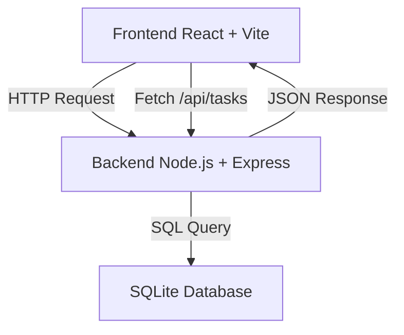
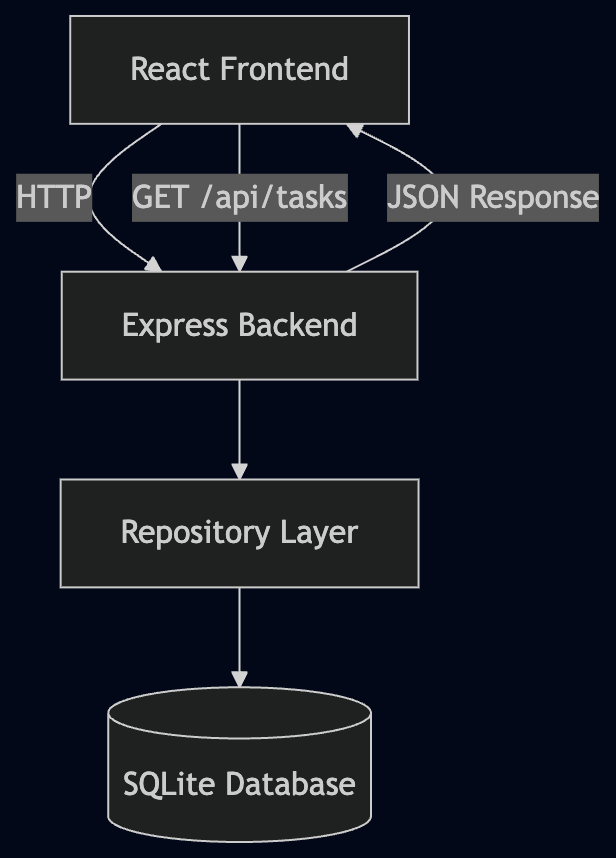

# ats-lti-project

[React] [Vite] [Node.js] [Express] [SQLite] [Exercise]

Proyecto base para el ejercicio **ATS de LTI**, construido desde cero utilizando **GitHub Copilot** y aplicando principios de arquitectura escalable.

---

# Descripción

Este proyecto implementa una aplicación **full-stack sencilla** que incluye frontend, backend y base de datos, demostrando la integración entre las distintas capas de una aplicación web.

El sistema permite recuperar una lista de tareas desde una API backend y mostrarlas en el frontend.

Aunque el ejercicio no requiere funcionalidad compleja, el proyecto se ha estructurado siguiendo **principios de arquitectura escalable**, de forma que pueda crecer fácilmente en futuras funcionalidades.

---

# Stack tecnológico

## Frontend

- React
- Vite
- JavaScript

## Backend

- Node.js
- Express

## Base de datos

- SQLite

## Herramientas

- Git
- GitHub
- VS Code
- GitHub Copilot

---

# Arquitectura aplicada

El proyecto está organizado siguiendo principios de:

- Clean Architecture (simplificada)
- Feature-Slice Architecture
- Separación de capas
- Domain Driven Design ligero

Esto permite que el proyecto pueda crecer sin generar acoplamiento entre componentes.

---

# Estructura del proyecto

```
ats-lti-project
│
├── frontend
│   └── Aplicación React creada con Vite
│
├── backend
│   ├── src
│   │   ├── features
│   │   │   └── tasks
│   │   │       ├── domain
│   │   │       ├── application
│   │   │       ├── infrastructure
│   │   │       └── presentation
│   │   │
│   │   └── shared
│   │       └── infrastructure
│   │
│   └── database
│       └── ats-lti.db
│
├── ARCHITECTURE.md
├── README.md
└── .gitignore
```

---

# Funcionalidad actual

La aplicación incluye:

- Frontend desarrollado con **React + Vite**
- Backend desarrollado con **Node.js + Express**
- Base de datos **SQLite**
- API REST básica
- Integración completa **frontend ↔ backend**

Endpoint disponible:

```
GET /api/tasks
```

El frontend consume esta API y muestra las tareas almacenadas en la base de datos.

---

# Flujo de arquitectura

El flujo de la aplicación sigue esta estructura:

```
UI (React)
   ↓
Hooks
   ↓
Use Cases
   ↓
API Client
   ↓
Backend (Express)
   ↓
Repository
   ↓
Database (SQLite)
```

Esto permite separar responsabilidades entre las distintas capas del sistema.

---

# Arquitectura del sistema



---

## Diagrama de arquitectura



---

# Problemas encontrados y soluciones

## 1. Error al abrir la base de datos SQLite

**Problema**

Al iniciar el backend aparecía el error:

```
SQLITE_CANTOPEN: unable to open database file
```

**Causa**

La carpeta donde debía almacenarse la base de datos (`backend/database`) no existía.

**Solución**

Se creó manualmente la carpeta:

```
backend/database
```

permitiendo que SQLite generara correctamente el archivo de base de datos.

---

## 2. Conexión entre frontend y backend

**Problema**

Era necesario verificar que el frontend pudiera comunicarse correctamente con el backend.

**Solución**

Se implementó una llamada `fetch` desde React al endpoint:

```
http://localhost:3001/api/tasks
```

gestionando la respuesta con `useEffect` y `useState`.

---

## 3. Organización de la arquitectura del proyecto

**Problema**

Al crecer el proyecto era necesario organizar el código de forma mantenible.

**Solución**

Se reorganizó la estructura siguiendo **Feature Slice Architecture**, separando:

- dominio
- casos de uso
- infraestructura
- presentación

Esto permite escalar el sistema sin acoplar frontend y backend.

---

## Requisitos previos

Antes de ejecutar el proyecto es necesario tener instalado:

- Node.js (versión 18 o superior)
- npm
- Git

Puedes comprobar tu versión de Node con:

```
node -v
```

---

# Cómo ejecutar el proyecto

## Backend

```
cd backend
npm install
npm run dev
```

Servidor disponible en:

```
http://localhost:3001
```

---

## Frontend

```
cd frontend
npm install
npm run dev
```

Aplicación disponible en:

```
http://localhost:5173
```

---

## Ejecutar frontend y backend al mismo tiempo

Para facilitar el desarrollo, el proyecto incluye un script que permite arrancar **frontend y backend simultáneamente** desde la raíz del proyecto.

Esto mejora la experiencia de desarrollo y evita tener que abrir dos terminales.

Ejecutar desde la raíz del proyecto:

```
npm install
npm run dev
```

Este comando inicia:

- Backend en `http://localhost:3001`
- Frontend en `http://localhost:5173`

Esto se consigue utilizando el paquete **concurrently**, que permite ejecutar múltiples procesos en paralelo desde un único comando.

---

## Configuración

La configuración de la API se encuentra centralizada en:

```
frontend/src/shared/config/index.js
```

Esto permite modificar fácilmente la URL del backend sin cambiar el resto del código.

Ejemplo:

```
export const config = {
  api: {
    baseUrl: 'http://localhost:3001'
  }
}
```

---

## Uso de GitHub Copilot

Durante el desarrollo del proyecto se utilizó **GitHub Copilot** como asistente de programación para:

- generación de estructura inicial del proyecto
- creación de endpoints backend
- generación de componentes React
- refactorización de arquitectura

Copilot se utilizó como herramienta de apoyo para acelerar el desarrollo, manteniendo siempre la revisión manual del código generado.

---

# Estado del proyecto

✔ Frontend funcionando
✔ Backend funcionando
✔ Base de datos SQLite conectada
✔ Integración completa entre frontend y backend
✔ Arquitectura preparada para escalar
✔ Proyecto documentado y subido a GitHub
